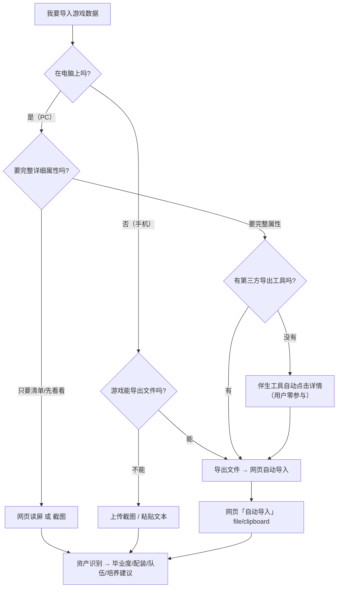

# 二游毕业指导 · 数据采集决策树

> 版本：v1.7.1 ｜ 说明：什么场景用哪种采集方式，按"想拿到什么 / 在什么设备 / 要不要自动化"三问决策。

## 总览：六种采集方式

| # | 方式 | 用户操作 | 能拿到 | 依赖 |
|---|---|---|---|---|
| ① | 示例账户 | 点一次按钮 | 三游戏演示数据 | 无 |
| ② | 粘贴文本 | 照着游戏打字 | 名称+等级+可手写属性 | 无 |
| ③ | 上传截图 | 游戏内截图→上传 | 当前画面文本（列表≈名称/等级） | RapidOCR |
| ④ | 网页读屏 | 浏览器授权选窗口+自己翻页 | 当前画面文本（列表≈名称/等级） | RapidOCR + toumanfen |
| ⑤ | 导出文件导入 | 第三方工具导出→选文件 | **完整属性**（含数值） | 导出工具 / 剪贴板 |
| ⑥ | 伴生工具自动点击 | 跑一条命令，**零参与** | **完整属性**（详情页全套数值） | PC + pyautogui，坐标校准 |

## 决策树

### mermaid 版



### 文本版

```
要导入数据？
├─ 只想快速演示/测试 → ① 示例账户（点一下）
├─ 不在电脑前（手机）
│   ├─ 能导出文件（第三方工具）→ ⑤ 导出文件导入
│   └─ 不能 → ③ 上传截图 或 ② 粘贴文本
└─ 在电脑前（PC）
    ├─ 只要清单/先看个大概 → ④ 网页读屏（自己翻页）或 ③ 截图
    └─ 要完整详细属性（数值级）
        ├─ 有第三方导出工具 → ⑤ 导出文件导入
        └─ 没有 → ⑥ 伴生工具自动点击（零参与）→ ⑤ 导入
```

## 场景速查表

| 场景 | 推荐方式 | 理由 |
|---|---|---|
| 课程答辩/演示 | ① 示例账户 | 一键出全量数据 |
| 临时看一眼某角色 | ② 粘贴文本 | 最快，无需截图 |
| 手机游戏账户 | ③ 上传截图 | 手机无读屏 |
| PC 且想扫全部装备但不想装东西 | ④ 网页读屏 + 定时采集 | 自己翻页，逐页累加 |
| 追求完整属性 + 有导出工具 | ⑤ 导出文件 | 零翻页、零点击 |
| 追求完整属性 + 零参与 | ⑥ 伴生工具自动点击 | 自动进详情拿全套数值 |
| 无 OCR 环境（系统 Python） | ② 粘贴 / ⑤ 导出 | 不依赖 RapidOCR |

## 关键提醒

- **列表页 ≠ 详情页**：游戏列表只显示名称/等级；**主/副词条数值在物品详情页**——所以"要完整属性"只有 ⑤⑥ 两条路（或手动点开再截图）；
- **浏览器只能看不能点**：网页读屏（④）永远拿不到详情页数值，除非你手动点开；
- **⑥ 需要一次坐标校准**（`--calibrate`），之后每次零参与；也可在网页「资产识别 → 读屏扫描 → 伴生工具自动点击」一键开启（实时进度、断点续采、完成后一键载入结果）；
- **断点续采**：⑥ 支持中断后 `--resume` 从上次位置继续（详见 `tools/auto_export.py --help`）。
